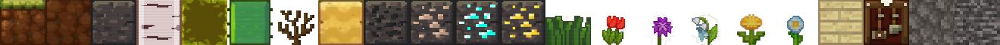

# Flutter + Flame course
We will build a 2d Minecraft

## Flutter commands to remember
Create a new project :`flutter create {PROJECT_NAME}` 
Add a package: `flutter pub add {PACKAGE_NAME}`


## Creating first Flame widget
In this project we will use the [Flame Engine](https://flame-engine.org/) to create a Minecraft 2d version

first we create a `MainGame` instance in `main-game.dart`:
```dart
import 'package:flame/game.dart';

class MainGame extends FlameGame {}

```

then, in `main.dart` we must ensure that flutter binds are initialized (normal when use a external lib at the begining of the projetc like this):
```dart
import 'package:flame/game.dart';
import 'package:flutter/material.dart';
import 'package:minecraft_2d/main-game.dart';

void main() {
  WidgetsFlutterBinding.ensureInitialized();
  runApp(GameWidget(game: MainGame()));
}
```
$\rightarrow$ For more info about [Flame Wigdets](FlameWidgets.md.md):


## Create the game
$\rightarrow$ Accordly to de [Game Design document](GameDesign.md):
we should change `main.dart` to :
```dart
void main() {
  WidgetsFlutterBinding.ensureInitialized();
  runApp(const MaterialApp(
    home: GameLayout(),
    debugShowCheckedModeBanner: false,
  ));
}
```
create a `GameLayout Widget`:
```dart
...

class GameLayout extends StatelessWidget {
  const GameLayout({super.key});

  @override
  Widget build(BuildContext context) {
    return Stack(
      children: [
        //the game logic
        GameWidget(game: MainGame()),
        //HUDs
        const ControllerWidget() 
      ],
    );
  }
}

```
### Creating the ControllerWidget
Theres is not diferente here from a normal Fluter app.
Just create a statefull Widget as placeholder e manager of buttons actions for the buttons and another widget with the buttons


### World data and player data
We will Create a instance of the world data, to comunicate bettween `ControllerWidget` and the Game, that will be inserted into `MainGame`

create a file called `globals/player_data.dart`:
```dart
class PlayerData {
  ComponentMotionState componentMotionState = ComponentMotionState.idle;
}

enum ComponentMotionState {
  walkingLeft,
  walkingRight,
  idle,
}
```

create a  `WorldData` class in a file called `globals/world_data.dart` whith playerData as property:

```dart
class WorldData {
  PlayerData playerData = PlayerData();
}
```

then create a instance  of the `WorldData` in `GameLayout` passing to `MainGame`:
```dart
class GameLayout extends StatelessWidget {
  const GameLayout({super.key});

  @override
  Widget build(BuildContext context) {
    return Stack(
      children: [
        //the game logic
        GameWidget(game: MainGame(worldData: WorldData())),
        //HUDs
        const ControllerWidget()
      ],
    );
  }
}
```
so, update `MainGame` to recieve `WorldData`

### Criando uma referência global do game
## Create and store a reference for the hole game
Now we will use the `GetX` package to manage states and dependency injection.
Firstly we create a `GameReference` class as an singleton (Getx way)
```dart
class GameReference {
  late MainGame gameReference;

  static GameReference get instance { //singleton_static type
    return Get.put(GameReference());
  }
}
```
then in the `MainGame` we set the `globalGameReference` property to `this`(`MainGame`):

```dart
...
class MainGame extends FlameGame {
  final WorldData worldData;
  GameReference globalGameReference = GameReference.instance
  Player playerComponent = Player();

  MainGame({required this.worldData}) {
    globalGameReference.gameReference = this;
  }

  @override
  FutureOr<void> onLoad() {
    ...
  }
}
```

as you can see, the main game will recieve an `worldData`:
### WorldData global
```dart

class WorldData {
  PlayerData playerData = PlayerData();
}
```
and world data instantiate a PlayerData


### PlayerData global
```dart
class PlayerData {
  // health
  // hunger
  // state (walking left, walking right, idle)
  ComponentMotionState componentMotionState = ComponentMotionState.idle;
}

enum ComponentMotionState {
  walkingLeft,
  walkingRight,
  idle,
}
```

### Updating gameControls to recieve and interact with this game reference
Now we will pass this game reference to the game control. The play now will do some actions when a button is tapped, in the `update()` SpriteAnimationComponent method:

```dart
import '../global/game_reference.dart';

class ControllerWidget extends StatelessWidget {
  const ControllerWidget({super.key});

  @override
  Widget build(BuildContext context) {
    final playerData =
        GameReference.instance.gameReference.worldData.playerData;

    return Positioned(
      bottom: 100,
      left: 20,
      child: Row(
        children: [
          ControllerButtonWidget(
            path: 'left_button.png',
            onTap: () {
              playerData.componentMotionState =
                  ComponentMotionState.walkingLeft;
            },
          ),
          ControllerButtonWidget(
            path: 'center_button.png',
            onTap: () {
              playerData.componentMotionState = ComponentMotionState.idle;
            },
          ),
          ControllerButtonWidget(
            path: 'right_button.png',
            onTap: () {
              playerData.componentMotionState =
                  ComponentMotionState.walkingRight;
            },
          )
        ],
      ),
    );
  }
}

```

### Handle player movement on Player SpriteAnimationComponent
```dart

...

class Player extends SpriteAnimationComponent {
  static const double _speed = 3;
  static bool _isFacingRight = true;
  static final Vector2 _playerDimensions = Vector2.all(60);
  static const _stepTimeIdle = 0.4;
  static const double _stepTimeWalking = 0.1;

  late SpriteSheet playerWalkingSpriteSheet;
  late SpriteSheet playerIdleSpriteSheet;

  late SpriteAnimation playerWalkingAnimation = playerWalkingSpriteSheet
      .createAnimation(row: 0, stepTime: _stepTimeWalking);

  late SpriteAnimation playerIdleAnimation =
      playerIdleSpriteSheet.createAnimation(row: 0, stepTime: _stepTimeIdle);

  @override
  Future<void> onLoad() async {
    super.onLoad();
    playerWalkingSpriteSheet = SpriteSheet(
      image: await Flame.images
          .load('sprite_sheets/player/player_walking_sprite_sheet.png'),
      srcSize: _playerDimensions,
    );

    playerIdleSpriteSheet = SpriteSheet(
      image: await Flame.images
          .load('sprite_sheets/player/player_idle_sprite_sheet.png'),
      srcSize: _playerDimensions,
    );
    priority = 2;
    anchor = Anchor.center;
    size = GameMethods.instance.blockSizes * 1.5;
    animation = playerIdleAnimation;
    position = Vector2(GameMethods.instance.getScreenSize().width * .1,
        GameMethods.instance.getScreenSize().height * .7);
  }

  @override
  void update(double dt) {
    super.update(dt);
    final gameWalkingReference = GameReference
        .instance.gameReference.worldData.playerData.componentMotionState;

    move(gameWalkingReference);
  }

  @override
  void onGameResize(Vector2 size) {
    super.onGameResize(size);
    size = GameMethods.instance.blockSizes * 1.5;
  }

  move(ComponentMotionState gameWalkingReference) {
    // Moving Left
    if (gameWalkingReference == ComponentMotionState.walkingLeft) {
      position.x -= _speed;
      if (_isFacingRight) {
        flipHorizontallyAroundCenter();
        _isFacingRight = false;
      }
      animation = playerWalkingAnimation;
    }

    // Moving right
    if (gameWalkingReference == ComponentMotionState.walkingRight) {
      position.x += _speed;
      if (!_isFacingRight) {
        flipHorizontallyAroundCenter();
        _isFacingRight = true;
      }
      animation = playerWalkingAnimation;
    }

    // Idle
    if (gameWalkingReference == ComponentMotionState.idle) {
      animation = playerIdleAnimation;
    }
  }
}

```


## Create the environment
Let's now create the world.

### define some constants
Create a file `lib/utils/constants.dart`:

```dart
const int chunkWidth = 16;
const int chunkHeight = 25;
```

### Chunk concept
**chunk**:  Is a Matrix, a List of Lists. In this case the screen divided in 25 block in height and 16 blocks in width. 16 columns and 25 rows.
Example:

```dart
const chunk = [
  [1.0, 1.2, 1.3, 1.4, 1.5, ..., 1.15, 1.16],
  [2.0, 2.2, 2.3, 2.4, 2.5, ..., 2.15, 2.16],
  [3.0, 3.2, 3.3, 3.4, 3.5, ..., 3.15, 3.16],
  ....
  [24.0, 24.2, 24.3, 24.4, 24.5, ..., 24.15, 24.16],
  [25.0, 25.2, 25.3, 25.4, 25.5, ..., 25.15, 25.16]
]
```

### The Enum of Block types
This is a enum to define a type of the block in the Chunk, `resources/blocks.dart`
```dart
enum BlocksEnum {
  grass,
  dirt,
  stone,
  birchLog,
  birchLeaf,
  cactus,
  deadBush,
  sand,
  coalOre,
  ironOre,
  diamondOre,
  goldOre,
  grassPlant,
  redFlower,
  purpleFlower,
  drippingWhiteFlower,
  yellowFlower,
  whiteFlower,
  birchPlank,
  craftingTable,
  cobblestone,
  bedrock,
}

```

### Helper functions to define sizes

```dart
class GameMethods {
  static late Size _gameScreenSize;

  static GameMethods get instance { //singleton_static
    return GameMethods();
  }

  set gameScreenSize(BuildContext context) {
    _gameScreenSize = MediaQuery.of(context).size;
  }

  Vector2 get blockSizes {
    return Vector2.all(getScreenSize().width / chunkWidth);
  }

  Size getScreenSize() {
    return _gameScreenSize;
  }

  Future<SpriteSheet> getBlockSpriteSheet() async {
    return SpriteSheet(
      image: await Flame.images.load(
        'sprite_sheets/blocks/block_sprite_sheet.png',
      ),
      srcSize: Vector2.all(
        60,
      ),
    );
  }

  Future<Sprite> getSpriteFromBlock(BlocksEnum block) async {
    SpriteSheet spriteSheet = await getBlockSpriteSheet();
    return spriteSheet.getSprite(0, block.index);
  }
  // get the sprite with the given enumblock passed
}
```
 
the `context` passed to `gameScreenSize` setter is defined at `lib/layout/game_layout.dart`:
```dart
class GameLayout extends StatelessWidget {
  const GameLayout({super.key});

  @override
  Widget build(BuildContext context) {
    GameMethods.instance.gameScreenSize = context;

    return Stack(
      children: [
        //the game logic
        GameWidget(
          game: MainGame(worldData: WorldData()),
        ),
        //HUDs
        const ControllerWidget()
      ],
    );
  }
}

```

### Block Sprite
The block Sprite is a single row spriteSheet, and now we will use the `getBlockSpriteSheet()` created previosly.

Now we create the `BlockComponent` that is the responsible for render each block of material:

```dart
class BlockComponent extends SpriteComponent {
  final BlocksEnum block;
  final Vector2 blockIndex;

  BlockComponent({required this.block, required this.blockIndex});

  @override
  FutureOr<void> onLoad() async {
    super.onLoad();
    size = GameMethods.instance.blockSizes;
    sprite = await GameMethods.instance.getSpriteFromBlock(block);
  }

  @override
  void onGameResize(Vector2 size) {
    super.onGameResize(size);
    size = GameMethods.instance.blockSizes;
    position = Vector2(
      GameMethods.instance.blockSizes.x * blockIndex.x,
      GameMethods.instance.blockSizes.x * blockIndex.y,
    );
  }
}
```
the `onGameResize` method makes the environment resposive. 

$\rightarrow$ [Player creation and movement](Player.md)  \
$\rightarrow$ [Terrain creation and biomes](Terrain.md)  \
$\rightarrow$ [Structures generation](Structures.md)  \
$\rightarrow$ [Ore generation](Ore.md)  \
$\rightarrow$ [Gravity and Collision](GravityAndCollision.md)  \
$\rightarrow$ [keyboard Support](KeyboardSupport.md)  \
$\rightarrow$ [Block placinng](BlockPlacing.md)  \


  \
**NOTES:**
**This tutotial is from Create a Minecraft game with Flutter + Flame ministred by [Aadhi Arun](https://github.com/AirAdmirer), in [Udemy](https://www.udemy.com/) platform. This summary is only for study, all content are intelectual property of the author**  
   \
Thanks [Aadhi Arun](https://github.com/AirAdmirer) for the course, it was very good and I learned a lot.