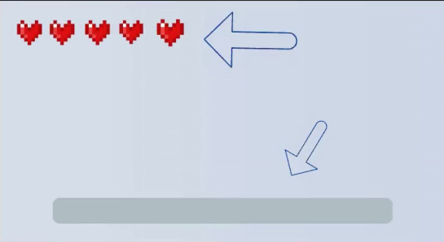

# minecraft_2d game design

The game consist in a layered stack(Flutter Widget), like an Photoshop project.
In this game we will need a stack of 3 layers:
- The game its self, the logical widget (MainGame)
- HUD Widget for inventory
- HUD widget for health bar

**NOTES:**
**This tutotial is from Create a Minecraft game with Flutter + Flame ministred by [Aadhi Arun](https://github.com/AirAdmirer) in [Udemy](https://www.udemy.com/) platform**

**This resume is only for study, all content an intelectual property is from the author [Aadhi Arun](https://github.com/AirAdmirer)**

$\Leftarrow$ [Voltar](README.md) 