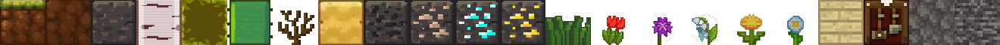

# Flutter + Flame course
We will build a 2d Minecraft

## Flutter commands to remember
Create a new project :`flutter create {PROJECT_NAME}` 
Add a package: `flutter pub add {PACKAGE_NAME}`


## Creating first Flame widget
In this project we will use the [Flame Engine](https://flame-engine.org/) to create a Minecraft 2d version

first we create a `MainGame` instance in `main-game.dart`:
```dart
import 'package:flame/game.dart';

class MainGame extends FlameGame {}

```

then, in `main.dart` we must ensure that flutter binds are initialized (normal when use a external lib at the begining of the projetc like this):
```dart
import 'package:flame/game.dart';
import 'package:flutter/material.dart';
import 'package:minecraft_2d/main-game.dart';

void main() {
  WidgetsFlutterBinding.ensureInitialized();
  runApp(GameWidget(game: MainGame()));
}
```

## Create the game
Accordly to de [Game Design document](GameDesign.md):
we should change `main.dart` to :
```dart
void main() {
  WidgetsFlutterBinding.ensureInitialized();
  runApp(const MaterialApp(
    home: GameLayout(),
    debugShowCheckedModeBanner: false,
  ));
}
```
create a `GameLayout Widget`:
```dart
...

class GameLayout extends StatelessWidget {
  const GameLayout({super.key});

  @override
  Widget build(BuildContext context) {
    return Stack(
      children: [
        //the game logic
        GameWidget(game: MainGame()),
        //HUDs
        const ControllerWidget() 
      ],
    );
  }
}

```
### Creating the ControllerWidget
Theres is not diferente here from a normal Fluter app.
Just create a statefull Widget as placeholder e manager of buttons actions for the buttons and another widget with the buttons

### Creating the player
For the player creation we will use some components from Flame library
```dart
import 'package:flame/components.dart';
import 'package:flame/flame.dart';
import 'package:flame/sprite.dart';

class Player extends SpriteAnimationComponent {
  @override
  Future<void> onLoad() async {
    super.onLoad();

    SpriteSheet playSpriteSheet = SpriteSheet(
      image: await Flame.images
          .load('sprite_sheets/player/player_walking_sprite_sheet.png'),
      srcSize: Vector2.all(60),
    );

    animation = playSpriteSheet.createAnimation(
      row: 0,
      stepTime: 0.1,
    );
    size = Vector2(100, 100);
  }
  ...
}
```

the `SpriteAnimationComponent` is a component that animates a `SpriteSheet`

first we need to create an `onLoad` function that will define the sprite sheet used and its dimensions

An SpriteSheet is a grided image with diferents positions for the player to be animated.

  

in the animation property of the load function of the `SpriteAnimationComponent` we must define the dimension of the grid (60px in the case) and the row, that is the row in the grided image.
then we create a `update` functions that will control the possition of the player on screen in a update

### Making player walk
Now we will need 2 animations, one for walking and another for idle at the player SpriteAnimationComponent
```dart
...

class Player extends SpriteAnimationComponent {
  static const double _speed = 3;
  static bool _isFacingRight = true;
  static final Vector2 _playerDimensions = Vector2.all(60);
  static const _stepTimeIdle = 0.4;
  static const double _stepTimeWalking = 0.1;

  late SpriteSheet playerWalkingSpriteSheet;
  late SpriteSheet playerIdleSpriteSheet;

  late SpriteAnimation playerWalkingAnimation = playerWalkingSpriteSheet
      .createAnimation(row: 0, stepTime: _stepTimeWalking);

  late SpriteAnimation playerIdleAnimation =
      playerIdleSpriteSheet.createAnimation(row: 0, stepTime: _stepTimeIdle);

  @override
  Future<void> onLoad() async {
    super.onLoad();
    playerWalkingSpriteSheet = SpriteSheet(
      image: await Flame.images
          .load('sprite_sheets/player/player_walking_sprite_sheet.png'),
      srcSize: _playerDimensions,
    );

    playerIdleSpriteSheet = SpriteSheet(
      image: await Flame.images
          .load('sprite_sheets/player/player_idle_sprite_sheet.png'),
      srcSize: _playerDimensions,
    );
    priority = 2;
    anchor = Anchor.center;
    size = Vector2(100, 100);
    animation = playerIdleAnimation;
    position = Vector2(GameMethods.instance.getScreenSize().width * .1,
        GameMethods.instance.getScreenSize().height * .7);
  }

  @override
  void update(double dt) {
    super.update(dt);
    final gameWalkingReference = GameReference
        .instance.gameReference.worldData.playerData.componentMotionState;

    move(gameWalkingReference);
  }

  ...

  move(ComponentMotionState gameWalkingReference) {
    // Moving Left
    if (gameWalkingReference == ComponentMotionState.walkingLeft) {
      position.x -= _speed;
      if (_isFacingRight) {
        flipHorizontallyAroundCenter();
        _isFacingRight = false;
      }
      animation = playerWalkingAnimation;
    }

    // Moving right
    if (gameWalkingReference == ComponentMotionState.walkingRight) {
      position.x += _speed;
      if (!_isFacingRight) {
        flipHorizontallyAroundCenter();
        _isFacingRight = true;
      }
      animation = playerWalkingAnimation;
    }

    // Idle
    if (gameWalkingReference == ComponentMotionState.idle) {
      animation = playerIdleAnimation;
    }
  }
}

```

### World data and player data
We will Create a instance of the world data, to comunicate bettween `ControllerWidget` and the Game, that will be inserted into `MainGame`

create a file called `globals/player_data.dart`:
```dart
class PlayerData {
  ComponentMotionState componentMotionState = ComponentMotionState.idle;
}

enum ComponentMotionState {
  walkingLeft,
  walkingRight,
  idle,
}
```

create a  `WorldData` class in a file called `globals/world_data.dart` whith playerData as property:

```dart
class WorldData {
  PlayerData playerData = PlayerData();
}
```

then create a instance  of the `WorldData` in `GameLayout` passing to `MainGame`:
```dart
class GameLayout extends StatelessWidget {
  const GameLayout({super.key});

  @override
  Widget build(BuildContext context) {
    return Stack(
      children: [
        //the game logic
        GameWidget(game: MainGame(worldData: WorldData())),
        //HUDs
        const ControllerWidget()
      ],
    );
  }
}
```
so, update `MainGame` to recieve `WorldData`

### Criando uma referência global do game
## Create and store a reference for the hole game
Now we will use the `GetX` package to manage states and dependency injection.
Firstly we create a `GameReference` class as an singleton (Getx way)
```dart
class GameReference {
  late MainGame gameReference;

  static GameReference get instance { //singleton_static type
    return Get.put(GameReference());
  }
}
```
then in the `MainGame` we set the `globalGameReference` property to `this`(`MainGame`):

```dart
...
class MainGame extends FlameGame {
  final WorldData worldData;
  GameReference globalGameReference = GameReference.instance
  Player playerComponent = Player();

  MainGame({required this.worldData}) {
    globalGameReference.gameReference = this;
  }

  @override
  FutureOr<void> onLoad() {
    ...
  }
}
```

as you can see, the main game will recieve an `worldData`:
### WorldData global
```dart

class WorldData {
  PlayerData playerData = PlayerData();
}
```
and world data instantiate a PlayerData


### PlayerData global
```dart
class PlayerData {
  // health
  // hunger
  // state (walking left, walking right, idle)
  ComponentMotionState componentMotionState = ComponentMotionState.idle;
}

enum ComponentMotionState {
  walkingLeft,
  walkingRight,
  idle,
}
```

### Updating gameControls to recieve and interact with this game reference
Now we will pass this game reference to the game control. The play now will do some actions when a button is tapped, in the `update()` SpriteAnimationComponent method:

```dart
import '../global/game_reference.dart';

class ControllerWidget extends StatelessWidget {
  const ControllerWidget({super.key});

  @override
  Widget build(BuildContext context) {
    final playerData =
        GameReference.instance.gameReference.worldData.playerData;

    return Positioned(
      bottom: 100,
      left: 20,
      child: Row(
        children: [
          ControllerButtonWidget(
            path: 'left_button.png',
            onTap: () {
              playerData.componentMotionState =
                  ComponentMotionState.walkingLeft;
            },
          ),
          ControllerButtonWidget(
            path: 'center_button.png',
            onTap: () {
              playerData.componentMotionState = ComponentMotionState.idle;
            },
          ),
          ControllerButtonWidget(
            path: 'right_button.png',
            onTap: () {
              playerData.componentMotionState =
                  ComponentMotionState.walkingRight;
            },
          )
        ],
      ),
    );
  }
}

```

### Handle player movement on Player SpriteAnimationComponent
```dart

...

class Player extends SpriteAnimationComponent {
  static const double _speed = 3;
  static bool _isFacingRight = true;
  static final Vector2 _playerDimensions = Vector2.all(60);
  static const _stepTimeIdle = 0.4;
  static const double _stepTimeWalking = 0.1;

  late SpriteSheet playerWalkingSpriteSheet;
  late SpriteSheet playerIdleSpriteSheet;

  late SpriteAnimation playerWalkingAnimation = playerWalkingSpriteSheet
      .createAnimation(row: 0, stepTime: _stepTimeWalking);

  late SpriteAnimation playerIdleAnimation =
      playerIdleSpriteSheet.createAnimation(row: 0, stepTime: _stepTimeIdle);

  @override
  Future<void> onLoad() async {
    super.onLoad();
    playerWalkingSpriteSheet = SpriteSheet(
      image: await Flame.images
          .load('sprite_sheets/player/player_walking_sprite_sheet.png'),
      srcSize: _playerDimensions,
    );

    playerIdleSpriteSheet = SpriteSheet(
      image: await Flame.images
          .load('sprite_sheets/player/player_idle_sprite_sheet.png'),
      srcSize: _playerDimensions,
    );
    priority = 2;
    anchor = Anchor.center;
    size = GameMethods.instance.blockSizes * 1.5;
    animation = playerIdleAnimation;
    position = Vector2(GameMethods.instance.getScreenSize().width * .1,
        GameMethods.instance.getScreenSize().height * .7);
  }

  @override
  void update(double dt) {
    super.update(dt);
    final gameWalkingReference = GameReference
        .instance.gameReference.worldData.playerData.componentMotionState;

    move(gameWalkingReference);
  }

  @override
  void onGameResize(Vector2 size) {
    super.onGameResize(size);
    size = GameMethods.instance.blockSizes * 1.5;
  }

  move(ComponentMotionState gameWalkingReference) {
    // Moving Left
    if (gameWalkingReference == ComponentMotionState.walkingLeft) {
      position.x -= _speed;
      if (_isFacingRight) {
        flipHorizontallyAroundCenter();
        _isFacingRight = false;
      }
      animation = playerWalkingAnimation;
    }

    // Moving right
    if (gameWalkingReference == ComponentMotionState.walkingRight) {
      position.x += _speed;
      if (!_isFacingRight) {
        flipHorizontallyAroundCenter();
        _isFacingRight = true;
      }
      animation = playerWalkingAnimation;
    }

    // Idle
    if (gameWalkingReference == ComponentMotionState.idle) {
      animation = playerIdleAnimation;
    }
  }
}

```


## Create the environment
Let's now create the world.

### define some constants
Create a file `lib/utils/constants.dart`:

```dart
const int chunkWidth = 16;
const int chunkHeight = 25;
```

### Chunk concept
**chunk**:  Is a Matrix, a List of Lists. In this case the screen divided in 25 block in height and 16 blocks in width. 16 columns and 25 rows.
Example:

```dart
const chunk = [
  [1.0, 1.2, 1.3, 1.4, 1.5, ..., 1.15, 1.16],
  [2.0, 2.2, 2.3, 2.4, 2.5, ..., 2.15, 2.16],
  [3.0, 3.2, 3.3, 3.4, 3.5, ..., 3.15, 3.16],
  ....
  [24.0, 24.2, 24.3, 24.4, 24.5, ..., 24.15, 24.16],
  [25.0, 25.2, 25.3, 25.4, 25.5, ..., 25.15, 25.16]
]
```

### The Enum of Block types
This is a enum to define a type of the block in the Chunk, `resources/blocks.dart`
```dart
enum BlocksEnum {
  grass,
  dirt,
  stone,
  birchLog,
  birchLeaf,
  cactus,
  deadBush,
  sand,
  coalOre,
  ironOre,
  diamondOre,
  goldOre,
  grassPlant,
  redFlower,
  purpleFlower,
  drippingWhiteFlower,
  yellowFlower,
  whiteFlower,
  birchPlank,
  craftingTable,
  cobblestone,
  bedrock,
}

```

### Helper functions to define sizes

```dart
class GameMethods {
  static late Size _gameScreenSize;

  static GameMethods get instance { //singleton_static
    return GameMethods();
  }

  set gameScreenSize(BuildContext context) {
    _gameScreenSize = MediaQuery.of(context).size;
  }

  Vector2 get blockSizes {
    return Vector2.all(getScreenSize().width / chunkWidth);
  }

  Size getScreenSize() {
    return _gameScreenSize;
  }

  Future<SpriteSheet> getBlockSpriteSheet() async {
    return SpriteSheet(
      image: await Flame.images.load(
        'sprite_sheets/blocks/block_sprite_sheet.png',
      ),
      srcSize: Vector2.all(
        60,
      ),
    );
  }

  Future<Sprite> getSpriteFromBlock(BlocksEnum block) async {
    SpriteSheet spriteSheet = await getBlockSpriteSheet();
    return spriteSheet.getSprite(0, block.index);
  }
  // get the sprite with the given enumblock passed
}
```
 
the `context` passed to `gameScreenSize` setter is defined at `lib/layout/game_layout.dart`:
```dart
class GameLayout extends StatelessWidget {
  const GameLayout({super.key});

  @override
  Widget build(BuildContext context) {
    GameMethods.instance.gameScreenSize = context;

    return Stack(
      children: [
        //the game logic
        GameWidget(
          game: MainGame(worldData: WorldData()),
        ),
        //HUDs
        const ControllerWidget()
      ],
    );
  }
}

```

### Block Sprite
The block Sprite is a single row spriteSheet, and now we will use the `getBlockSpriteSheet()` created previosly.

Now we create the `BlockComponent` that is the responsible for render each block of material:

```dart
class BlockComponent extends SpriteComponent {
  final BlocksEnum block;
  final Vector2 blockIndex;

  BlockComponent({required this.block, required this.blockIndex});

  @override
  FutureOr<void> onLoad() async {
    super.onLoad();
    size = GameMethods.instance.blockSizes;
    sprite = await GameMethods.instance.getSpriteFromBlock(block);
  }

  @override
  void onGameResize(Vector2 size) {
    super.onGameResize(size);
    size = GameMethods.instance.blockSizes;
    position = Vector2(
      GameMethods.instance.blockSizes.x * blockIndex.x,
      GameMethods.instance.blockSizes.x * blockIndex.y,
    );
  }
}
```
the `onGameResize` method makes the environment resposive. 

### Make the player responsive too
```dart
class Player extends SpriteAnimationComponent {
  ...

  @override
  Future<void> onLoad() async {
    super.onLoad();
   ...
    size = GameMethods.instance.blockSizes * 1.5;
    ...
  }

...

  @override
  void onGameResize(Vector2 size) {
    super.onGameResize(size);
    size = GameMethods.instance.blockSizes * 1.5;
  }

  ...
}

```

### Make Procedural terrain generation
Lets create a randon terrain with Procedural terrain generation concept, using the `fast_noise` package
`flutter pub add fast_noise`  using the `Perlin noise` (detailed explaned by [Khan academy]('https://pt.khanacademy.org/computing/computer-programming/programming-natural-simulations/programming-noise/a/perlin-noise'))

lets create a constants file `utils/constants.dart` whith the chunk values:
```dart
const int chunkWidth = 16; //16 columns of blocks
const int chunkHeight = 25; //25 rows of blocks

```

now lets create a file `utils/chunk_generation_methods.dart`:
```dart	
class ChunkGenerationMethods {
  static ChunkGenerationMethods get instance {
    return ChunkGenerationMethods();
  }

  ///
  /// Generates a null chunk (piece of soil) with the given width and height, filled with null
  ///
  List<List<BlocksEnum?>> generateNullChunk() {
    return List.generate(
      chunkHeight,
      (index) => List.generate(
        chunkWidth,
        (idx) => null,
      ),
    );
  }

  ///
  /// Generates the sreen chunk with Perlin noise, first layer with grass, second layer with dirt and the rest with stone
  ///
  List<List<BlocksEnum?>> generateChunk() {
    List<List<BlocksEnum?>> chunk = generateNullChunk();

    List<List<double>> rawNoise = noise2(
      chunkWidth,
      1, //height 1, only one dimension of noise
      noiseType: NoiseType.Perlin,
      frequency: 0.05,
      seed: 98765493, //aparentemente o seed é um id unico de noises
    );

    final List<int> yValues = getYValuesFromRawNoise(rawNoise);
    chunk = generatePrimarySoil(chunk, yValues, BlocksEnum.grass);
    chunk = generateSecondarySoil(chunk, yValues, BlocksEnum.dirt);
    chunk = generateStoneSoil(chunk);
    return chunk;
  }

  ///
  /// Generates the primary soil (grass) with the given yValues and blockEnum
  ///
  List<List<BlocksEnum?>> generatePrimarySoil(
      List<List<BlocksEnum?>> chunk, List<int> yValues, BlocksEnum block) {
    yValues.asMap().forEach((int idx, value) {
      chunk[value][idx] = block;
    });

    return chunk;
  }

  ///
  /// Generates the secondary soil (dirt) with the given yValues and blockEnum
  ///
  List<List<BlocksEnum?>> generateSecondarySoil(
      List<List<BlocksEnum?>> chunk, List<int> yValues, BlocksEnum block) {
    final int freeAreaMax = GameMethods.instance.maxSecondarySoilHeight;
    yValues.asMap().forEach((int idx, value) {
      for (int i = value + 1; i <= freeAreaMax; i++) {
        chunk[i][idx] = block;
      }
    });

    return chunk;
  }

  ///
  /// Generates the stone soil with the given chunk
  ///
  List<List<BlocksEnum?>> generateStoneSoil(List<List<BlocksEnum?>> chunk) {
    final int freeArea = GameMethods.instance.maxSecondarySoilHeight;
    final int freeAreaMaxPlusOne = freeArea + 1;
    for (int width = 0; width < chunkWidth; width++) {
      for (int position = freeAreaMaxPlusOne;
          position < chunk.length;
          position++) {
        chunk[position][width] = BlocksEnum.stone;
      }
    }

    final int x1 = Random().nextInt(chunkWidth ~/ 2);
    final int x2 = x1 + Random().nextInt(chunkWidth ~/ 2);
    chunk[freeArea].fillRange(x1, x2, BlocksEnum.stone);

    return chunk;
  }

  ///
  /// Generates the X nad Y values from the [rawNoise] list
  ///
  getYValuesFromRawNoise(List<List<double>> rawNoise) {
    List<int> yValues = [];
    final int freeArea = GameMethods.instance.notGroundArea;

    yValues = rawNoise.map((List<double> value) {
      return (value[0] * 10).toInt().abs() + freeArea;
    }).toList();
    return yValues;
  }
}
```

changing the main game to render the chunk:
```dart
class MainGame extends FlameGame {
  final WorldData worldData;
  final GameReference globalGameReference = Get.put(GameReference());
  Player playerComponent = Player();

  MainGame({required this.worldData}) {
    globalGameReference.gameReference = this;
  }

  @override
  FutureOr<void> onLoad() {
    super.onLoad();
    camera.followComponent(playerComponent);
    add(playerComponent);
    renderChunk(ChunkGenerationMethods.instance.generateChunk());
  }

  void renderChunk(List<List<BlocksEnum?>> chunk) {
    chunk.asMap().forEach((int yIdx, rowOfBlocks) {
      rowOfBlocks.asMap().forEach((int xIdx, block) {
        if (block != null) {
          add(
            BlockComponent(
              block: block,
              blockIndex: Vector2(xIdx.toDouble(), yIdx.toDouble()),
            ),
          );
        }
      });
    });
  }
}
```

#### Biomes
Lets generate the terrain accordly to the biome. For this, we will create a `/resources/biomes.dart`:
```dart
enum BiomesEnum {
  desert,
  birchForest,
}

class BiomeData {
  final BlocksEnum primarySoil;
  final BlocksEnum secondarySoil;

  BiomeData({
    required this.primarySoil,
    required this.secondarySoil,
  });

  factory BiomeData.getBiomeDataFor(BiomesEnum biome) {
    // fatcory singleton
    switch (biome) {
      case BiomesEnum.desert:
        return BiomeData(
          primarySoil: BlocksEnum.sand,
          secondarySoil: BlocksEnum.sand,
        );
      case BiomesEnum.birchForest:
        return BiomeData(
          primarySoil: BlocksEnum.grass,
          secondarySoil: BlocksEnum.dirt,
        );
    }
  }
}

```

changing the `/utils/chunk_generation_methods.dart`:
```dart
... 
class ChunkGenerationMethods {
  ...
    List<List<BlocksEnum?>> generateChunk() {
    List<List<BlocksEnum?>> chunk = generateNullChunk();

    BiomesEnum biomeType =
        Random().nextBool() ? BiomesEnum.desert : BiomesEnum.birchForest; //temporary
    BiomeData biome = BiomeData.getBiomeDataFor(biomeType);

    List<List<double>> rawNoise = noise2(
      chunkWidth,
      1, //height 1, only one dimension of noise
      noiseType: NoiseType.Perlin,
      frequency: 0.05,
      seed: 98765493, //aparentemente o seed é um id unico de noises
    );

    final List<int> yValues = getYValuesFromRawNoise(rawNoise);
    // chunk = generatePrimarySoil(chunk, yValues, BlocksEnum.grass);
    chunk = generatePrimarySoil(chunk, yValues, biome.primarySoil);
    chunk = generateSecondarySoil(chunk, yValues, biome.secondarySoil);
    chunk = generateStoneSoil(chunk);
    return chunk;
  }
  ...
}
...
```

### Continuative em Consequetive Chunk generatrion

lets generate continuative chunks in both sides of the initial chunk (left and right), following the same noise pattern. 

firts, lets add this variables to the world data at `lib/globals/world_data.dart`:
```dart
class WorldData {
  final int seed;
  WorldData({required this.seed});
  PlayerData playerData = PlayerData();

  List<List<BlocksEnum?>> rightWorldChunks = List.generate(
    chunkHeight,
    (index) => [],
  );
  List<List<BlocksEnum?>> leftWorldChunks = List.generate(
    chunkHeight,
    (index) => [],
  );
}
```

now lets update our `utils/chunkGenerationMethods.dart` class:
```dart	
...
class ChunkGenerationMethods {
  ...
  List<List<BlocksEnum?>> generateChunk(int chunkIdx) {
    List<List<BlocksEnum?>> chunk = generateNullChunk();
    int seed = GameReference.instance.gameReference.worldData.seed;
    BiomesEnum biomeType =
        Random().nextBool() ? BiomesEnum.desert : BiomesEnum.birchForest;
    BiomeData biome = BiomeData.getBiomeDataFor(biomeType);

    final isLeftWorldChunk = chunkIdx < 0;
    seed = isLeftWorldChunk ? seed : (seed + 1);
    List<List<double>> rawNoise = noise2(
      chunkWidth * (isLeftWorldChunk ? chunkIdx.abs() : (chunkIdx + 1)),
      1, //height 1, only one dimension of noise
      noiseType: NoiseType.Perlin,
      frequency: 0.05,
      seed: seed, //aparentemente o seed é um id unico de noises
    );

    final List<int> yValues = getYValuesFromRawNoise(rawNoise);
    yValues.removeRange(
        0, chunkWidth * (isLeftWorldChunk ? (chunkIdx.abs() - 1) : chunkIdx));
    // get the yValues from the rawNoise and remove the chunkWidth * chunkIdx values (aways getting the last chunkWidth values)
    // in others words, aways getting the yValues only for the current chunk

    chunk = generatePrimarySoil(chunk, yValues, biome.primarySoil);
    chunk = generateSecondarySoil(chunk, yValues, biome.secondarySoil);
    chunk = generateStoneSoil(chunk);
    return chunk;
  }
}
```

now, lets update the `utils/game_methods.dart` class:
```dart
...
class GameMethods {
  ...
  void addWorldChunk(List<List<BlocksEnum?>> chunk, bool isLeftWorldChunk) {
    if (isLeftWorldChunk) {
      final leftWorldChunks =
          GameReference.instance.gameReference.worldData.leftWorldChunks;

      chunk.asMap().forEach((yIdx, row) {
        leftWorldChunks[yIdx].addAll(row);
      });
    } else {
      final rightWorldChunks =
          GameReference.instance.gameReference.worldData.rightWorldChunks;

      chunk.asMap().forEach((yIdx, row) {
        rightWorldChunks[yIdx].addAll(row);
      });
    }
  }

  List<List<BlocksEnum?>> getIndividualChunk(int chunkIdx) {
    final isLeftWorldChunk = chunkIdx < 0;

    final List<List<BlocksEnum?>> chunk = [];
    final worldChunks = !isLeftWorldChunk
        ? GameReference.instance.gameReference.worldData.rightWorldChunks
        : GameReference.instance.gameReference.worldData.leftWorldChunks;
    worldChunks.asMap().forEach((yIdx, rowOfCombinedBlocks) {
      List<BlocksEnum?> currChunk = rowOfCombinedBlocks.sublist(
        chunkWidth * (isLeftWorldChunk ? (chunkIdx.abs() - 1) : chunkIdx),
        chunkWidth * (isLeftWorldChunk ? (chunkIdx.abs()) : (chunkIdx + 1)),
      );
      if (isLeftWorldChunk) currChunk = currChunk.reversed.toList();
      // to the noise be generated in the right way when the chunk index is negative

      chunk.add(currChunk);
    });
    return chunk;
  }
}

```

and then the MainGame `lib/main-game.dart`:
```dart
class MainGame extends FlameGame {
  final WorldData worldData;
  final GameReference globalGameReference = Get.put(GameReference());
  Player playerComponent = Player();

  MainGame({required this.worldData}) {
    globalGameReference.gameReference = this;
  }

  @override
  FutureOr<void> onLoad() {
    super.onLoad();
    camera.followComponent(playerComponent);
    add(playerComponent);
    GameMethods.instance
        .addWorldChunk(ChunkGenerationMethods.instance.generateChunk(-1), true);
    GameMethods.instance
        .addWorldChunk(ChunkGenerationMethods.instance.generateChunk(0), false);
    GameMethods.instance
        .addWorldChunk(ChunkGenerationMethods.instance.generateChunk(1), false);
    renderChunk(-1);
    renderChunk(0);
    renderChunk(1);
  }

  void renderChunk(int chunkIdx) {
    final currChunk = GameMethods.instance.getIndividualChunk(chunkIdx);
    currChunk.asMap().forEach((int yIdx, rowOfBlocks) {
      rowOfBlocks.asMap().forEach((int xIdx, block) {
        if (block != null) {
          add(
            BlockComponent(
              block: block,
              blockIndex: Vector2(
                  (chunkWidth * chunkIdx) + xIdx.toDouble(), yIdx.toDouble()),
            ),
          );
        }
      });
    });
  }
}
```
### Update and render dynamic chunks
So now, we will render the chunks based on the player's position. 
in  the `utils/game_methods.dart` we will create a get `playerXposition` and another get `currentChunk`:
the `playerXposition` will tell us where the player is tho get the `currentChunk`, to allow us to render the chunks dynamically based on the player position, and around him.

```dart
...
class GameMethods {
  ...
  double get playerXposition {
    final playerPosition =
        GameReference.instance.gameReference.playerComponent.position;
    return playerPosition.x / blockSizes.x;
  }

  int get currentChunk {
    final isLeftWorldChunk = playerXposition < 0;
    final posfix = isLeftWorldChunk ? -1 : 0;
    return (playerXposition ~/ chunkWidth) + posfix;
  }
}
```

For this, we will create a `update` method in the `MainGame` class:
```dart
class MainGame extends FlameGame {
  final WorldData worldData;
  final GameReference globalGameReference = Get.put(GameReference());
  Player playerComponent = Player();

  MainGame({required this.worldData}) {
    globalGameReference.gameReference = this;
  }

  @override
  FutureOr<void> onLoad() {
    super.onLoad();
    camera.followComponent(playerComponent);
    add(playerComponent);
  }

  @override
  void update(double dt) {
    super.update(dt);
    worldData.chunksToRender.asMap().forEach((idx, chunkIdx) {
      final rightChunkLength = worldData.rightWorldChunks[0].length;
      final leftChunkLength = worldData.leftWorldChunks[0].length;

      if (!worldData.allreadyRenderedChunks.contains(chunkIdx)) {
        if (chunkIdx >= 0) {
          if ((rightChunkLength ~/ chunkWidth) < chunkIdx + 1) {
            GameMethods.instance.addWorldChunk(
              ChunkGenerationMethods.instance.generateChunk(chunkIdx),
              false,
            );
          }
          renderChunk(chunkIdx);
          worldData.allreadyRenderedChunks.add(chunkIdx);
        } else {
          //let
          if ((leftChunkLength ~/ chunkWidth) < chunkIdx.abs() + 1) {
            GameMethods.instance.addWorldChunk(
              ChunkGenerationMethods.instance.generateChunk(chunkIdx),
              true,
            );
          }
          renderChunk(chunkIdx);
          worldData.allreadyRenderedChunks.add(chunkIdx);
        }
      }
    });
  }

  void renderChunk(int chunkIdx) {
    final currChunk = GameMethods.instance.getIndividualChunk(chunkIdx);
    currChunk.asMap().forEach((int yIdx, rowOfBlocks) {
      rowOfBlocks.asMap().forEach((int xIdx, block) {
        if (block != null) {
          add(
            BlockComponent(
              block: block,
              blockIndex: Vector2(
                  (chunkWidth * chunkIdx) + xIdx.toDouble(), yIdx.toDouble()),
            ),
          );
        }
      });
    });
  }
}

```

**NOTES:**
**This tutotial is from Create a Minecraft game with Flutter + Flame ministred by [Aadhi Arun](https://github.com/AirAdmirer) in [Udemy](https://www.udemy.com/) platform**

**This summary is only for study, all content are intelectual property of the author [Aadhi Arun](https://github.com/AirAdmirer)**